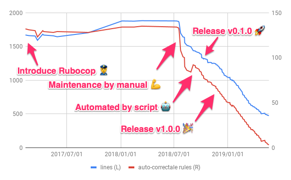
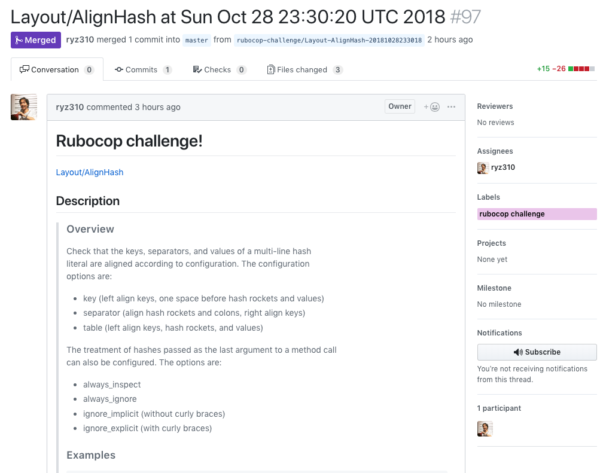
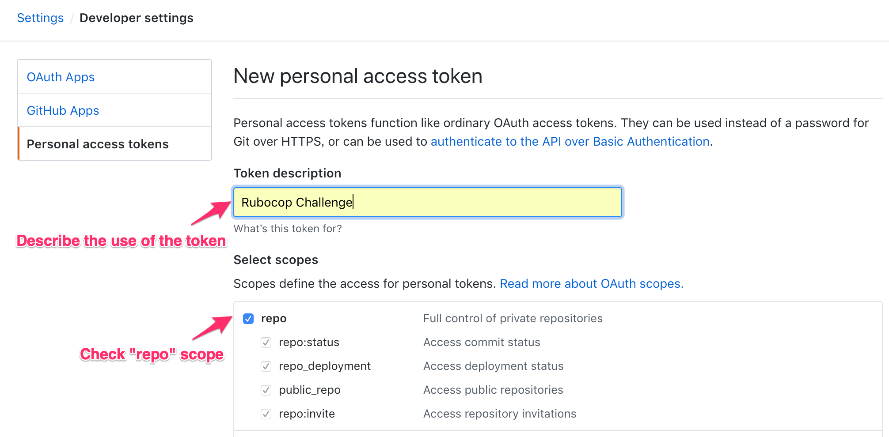

# Rubocop Challenger

[](https://circleci.com/gh/ryz310/rubocop_challenger/tree/master) [](https://badge.fury.io/rb/rubocop_challenger) [](https://codeclimate.com/github/ryz310/rubocop_challenger/maintainability) [](https://codeclimate.com/github/ryz310/rubocop_challenger/test_coverage)

If you introduce [`rubocop`](https://github.com/rubocop-hq/rubocop) to an existing Rails project later, you will use [`$ rubocop --auto-gen-config`](https://github.com/rubocop-hq/rubocop/blob/master/manual/configuration.md#automatically-generated-configuration). But it will make a huge `.rubocop_todo.yml` and make you despair.
On the other hand, `rubocop` has [`--auto-correct`](https://github.com/rubocop-hq/rubocop/blob/master/manual/basic_usage.md#other-useful-command-line-flags) option, it is possible to automatically repair the writing which does not conform to the rule. But since it occasionally destroys your code, it is quite dangerous to apply all at once.
It is ideal that to remove a disabled rule from `.rubocop_todo.yml` every day, to check whether it passes test, and can be obtained consent from the team. But it requires strong persistence and time.
I call such work *Rubocop Challenge*. And the *RubocopChallenger* is a gem to support this challenge!

## The history of RubocopChallenger with decrease of offence codes

The following chart shows the history of RubocopChallenger and decrease of offence codes at a `.rubocop_todo.yml`. The project was released at 5 years ago, and then it was introduced the RuboCop gem for huge source code including a lots of offence codes. Before using the RubocopChallenger, it was not maintain to reduce offence codes. One day, I felt a crisis and started maintain with manual. I made a lots of Pull Requests to reduce them but it's a load for me and reviewers. So I created a script for automation the flow, which is the predecessor of Rubocop Challenger gem. It brought reducing the offence codes continuously. After 8 months, finally it has done. There is no auto-correctable offence codes.
But there are many offences which is un-auto-correctable yet. I will try to reduce it with the RubocopChallenger. The RubocopChallenger will
be continued to evolve.



## Rubocop Challenge Flow

1. Run *RubocopChallenger* periodically from CI tool etc.
1. When *RubocopChallenger* starts, delete a disabled rule from `.rubocop_todo.yml` existing in your project, execute `$ rubocop --auto-correct` and create a PR which include modified results
1. You confirm the PR passes testing and then merge it if there is no problem

[](https://github.com/ryz310/rubocop_challenger/pull/97)

## Usage

### 1. Edit your Gemfile

If you do not specify the version of `rubocop` gem so you do not have to add `rubocop_challenger` gem in your Gemfile (**Recommended**).

If you specify the version so put this line in your Gemfile.

```rb
gem 'rubocop_challenger', group: :development, require: false
```

### 2. Setting GitHub personal access token

GitHub personal access token is required for sending pull requests to your repository.

1. Go to [your account's settings page](https://github.com/settings/tokens) and [generate a new token](https://github.com/settings/tokens/new) with "repo" scope
  
1. On [CircleCI](https://circleci.com) dashboard, go to your application's "Project Settings" -> "Environment Variables"
1. Add an environment variable `GITHUB_ACCESS_TOKEN` with your GitHub personal access token
  

### 3. Configure .circleci/config.yml

Configure your `.circleci/config.yml` to run rubocop_challenger, for example:

```yml
# .circleci/config.yml
version: 2

jobs:
  rubocop_challenge:
    docker:
      - image: circleci/ruby:3.0
    working_directory: ~/repo
    steps:
      - checkout
      - run:
          name: Rubocop Challenge
          command: |
            gem install rubocop_challenger
            rubocop_challenger go \
              --email=rubocop-challenger@example.com \
              --name="Rubocop Challenger"

workflows:
  version: 2

  nightly:
    triggers:
      - schedule:
          cron: "30 23 * * 1,2,3" # 8:30am every Tuesday, Wednsday and Thursday (JST)
          filters:
            branches:
              only:
                - master
    jobs:
      - rubocop_challenge
```

## CLI command references

```sh
$ rubocop_challenger help

Commands:
  rubocop_challenger go --email=EMAIL --name=NAME  # Run `$ rubocop --auto-correct` and create a PR to GitHub repo
  rubocop_challenger help [COMMAND]                # Describe available commands or one specific command
  rubocop_challenger version                       # Show current version
```

### Command-line Flags

```sh
$ rubocop_challenger help go

Usage:
  rubocop_challenger go --email=EMAIL --name=NAME

Options:
      --email=EMAIL                                              # The Pull Request committer email
      --name=NAME                                                # The Pull Request committer name
  f, [--file-path=FILE_PATH]                                     # Set your ".rubocop_todo.yml" path
                                                                 # Default: .rubocop_todo.yml
  t, [--template=TEMPLATE]                                       # A Pull Request template `erb` file path.You can use variable that `title`, `rubydoc_url`, `description` and `examples` into the erb file.
      [--mode=MODE]                                              # Mode to select deletion target. You can choice "most_occurrence", "least_occurrence", or "random"
                                                                 # Default: most_occurrence
  b, [--base-branch=BASE_BRANCH]                                 # The Branch to merge into
                                                                 # Default: master
  l, [--labels=one two three]                                    # Label to give to Pull Request
                                                                 # Default: ["rubocop challenge"]
      [--project-column-name=PROJECT_COLUMN_NAME]                # A project column name. You can add the created PR to the GitHub project
      [--project-id=N]                                           # A target project ID. If does not supplied, this method will find a project which associated the repository. When the repository has multiple projects, you should supply this.
      [--no-create-pr]                                           # No create a pull request (for testing)
      [--exclude-limit=N]                                        # For how many exclude properties when creating the .rubocop_todo.yml
      [--auto-gen-timestamp], [--no-auto-gen-timestamp]          # Include the date and time when creating the .rubocop_todo.yml
                                                                 # Default: true
      [--only-safe-auto-correct], [--no-only-safe-auto-correct]  # If given `true`, it executes `rubocop --auto-correct`,it means to correct safe cops only.
      [--verbose], [--no-verbose]                                # Displays executing command.

Run `$ rubocop --auto-correct` and create a PR to GitHub repo
```

## Requirement

* Ruby 2.5 or higher

## Development

After checking out the repo, run `bin/setup` to install dependencies. Then, run `rake spec` to run the tests. You can also run `bin/console` for an interactive prompt that will allow you to experiment.

To install this gem onto your local machine, run `bundle exec rake install`. To release a new version, update the version number in `version.rb`, and then run `bundle exec rake release`, which will create a git tag for the version, push git commits and tags, and push the `.gem` file to [rubygems.org](https://rubygems.org).

## Contributing

Bug reports and pull requests are welcome on GitHub at https://github.com/ryz310/rubocop_challenger. This project is intended to be a safe, welcoming space for collaboration, and contributors are expected to adhere to the [Contributor Covenant](http://contributor-covenant.org) code of conduct.

## License

The gem is available as open source under the terms of the [MIT License](https://opensource.org/licenses/MIT).

## Code of Conduct

Everyone interacting in the RubocopChallenger project’s codebases, issue trackers, chat rooms and mailing lists is expected to follow the [code of conduct](https://github.com/ryz310/rubocop_challenger/blob/master/CODE_OF_CONDUCT.md).
